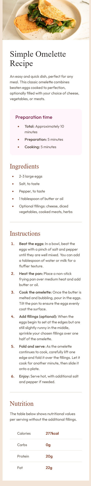
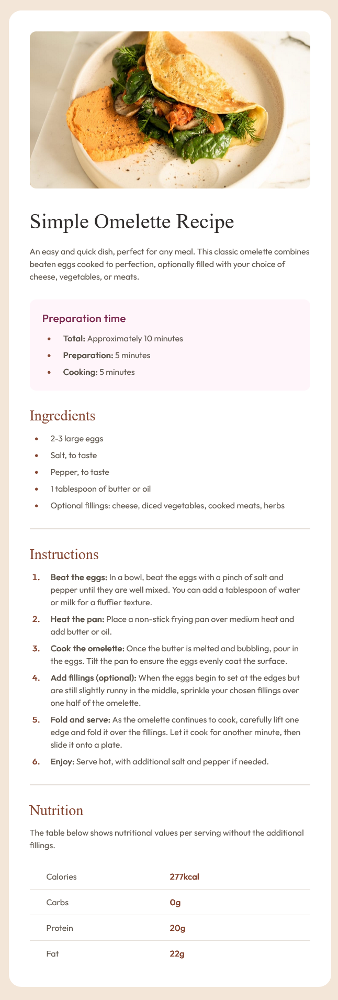
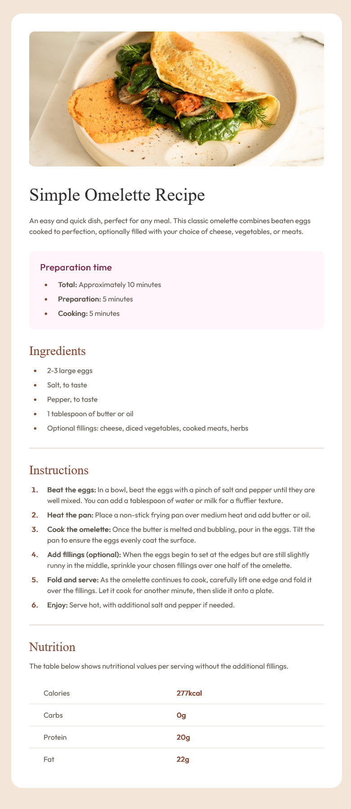

# Frontend Mentor - Recipe page solution

This is a solution to the [Recipe page challenge on Frontend Mentor](https://www.frontendmentor.io/challenges/recipe-page-KiTsR8QQKm). Frontend Mentor challenges help you improve your coding skills by building realistic projects. 

## Table of contents

- [Overview](#overview)
  - [The challenge](#the-challenge)
  - [Screenshot](#screenshot)
  - [Links](#links)
- [My process](#my-process)
  - [Built with](#built-with)
  - [What I learned](#what-i-learned)
  - [Continued development](#continued-development)
- [Author](#author)

## Overview
This Frontend Mentor chanllenge is about coding a recipe page for 3 different type of screen (mobile, tablet, and desktop). The objective is the correct use of semantic tags.
### Screenshot

### Links

- Solution URL: [Githup Code Solution](https://github.com/cacesasa/recipe_page)
- Live Site URL: [Add live site URL here](https://your-live-site-url.com)

## My process
I took a mobile first approach by building the mobile version first, and then appying media queries for the tablet and desktop versions.
### Built with

- Semantic HTML5 markup
- CSS custom properties
- CSS Grid
- Mobile-first workflow

### What I learned

The correct use of semantic tags.

### Continued development

Keep working on my CSS and JavaScript development.

## Author

- Frontend Mentor - [@cacesasa](https://www.frontendmentor.io/profile/cacesasa)
- Twitter - [@cacesasa](https://www.twitter.com/cacesasa)

